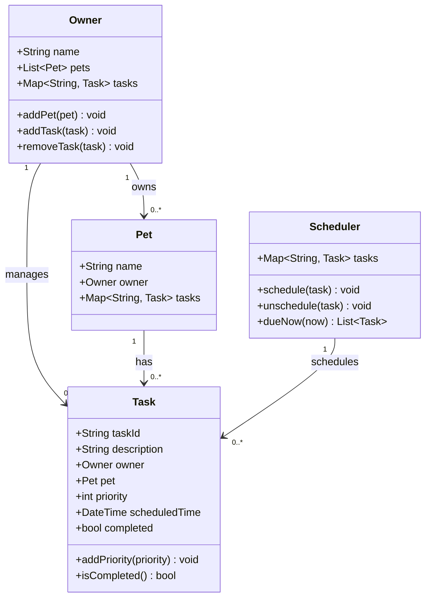

# Pet Care App — Class Diagram

```mermaid
classDiagram
    class Owner {
        +String name
        +List~Pet~ pets
        +Map~String, Task~ tasks
        +addPet(pet) void
        +addTask(task) void
        +removeTask(task) void
    }

    class Pet {
        +String name
        +Owner owner
        +Map~String, Task~ tasks
    }

    class Task {
        +String taskId
        +String description
        +Owner owner
        +Pet pet
        +int priority
        +DateTime scheduledTime
        +bool completed
        +addPriority(priority) void
        +isCompleted() bool
    }

    class Scheduler {
        +Map~String, Task~ tasks
        +schedule(task) void
        +unschedule(task) void
        +dueNow(now) List~Task~
    }

    Owner "1" --> "0..*" Pet : owns
    Owner "1" --> "0..*" Task : manages
    Pet "1" --> "0..*" Task : has
    Scheduler "1" --> "0..*" Task : schedules
```
